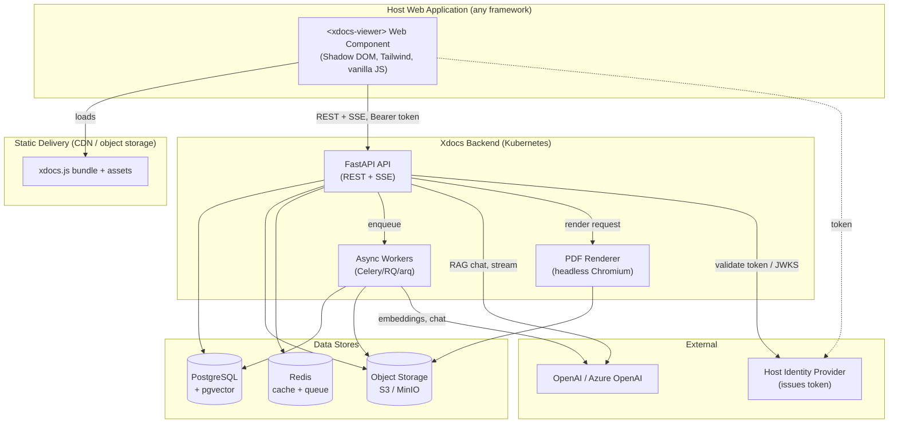
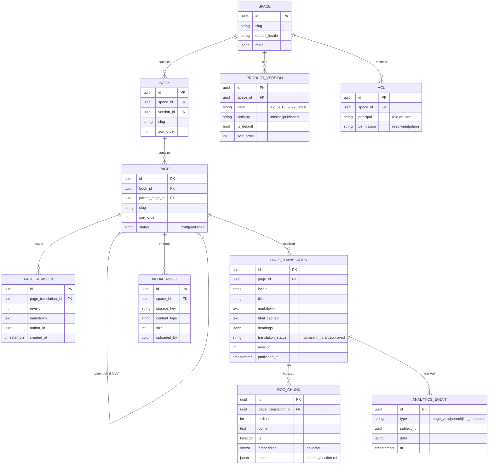
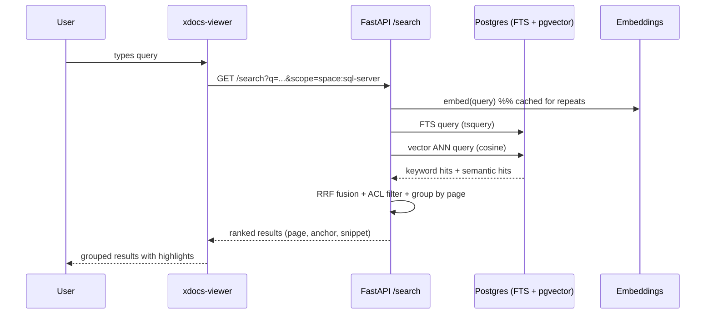
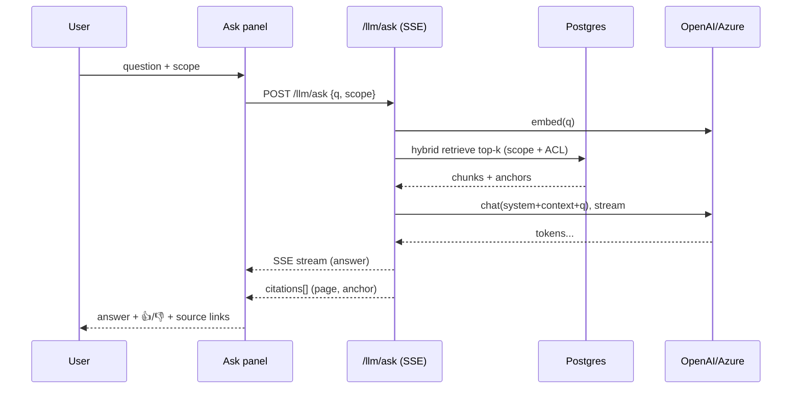
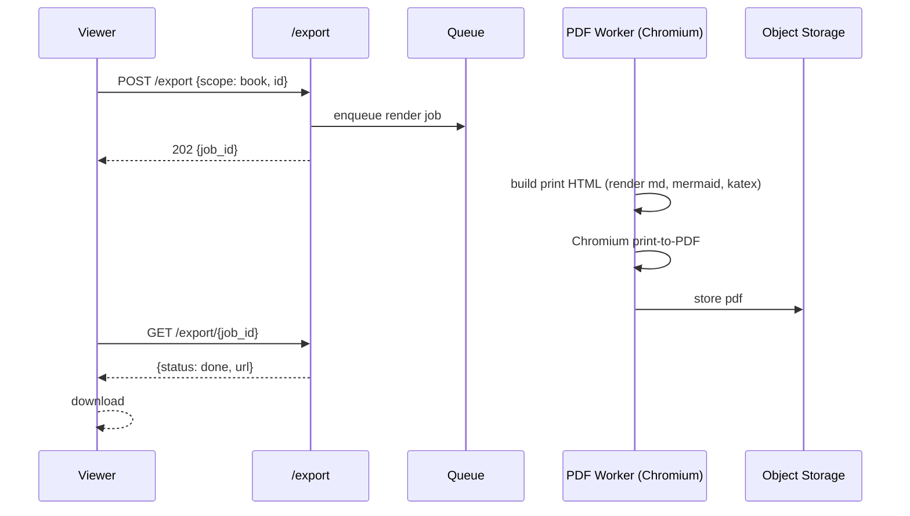
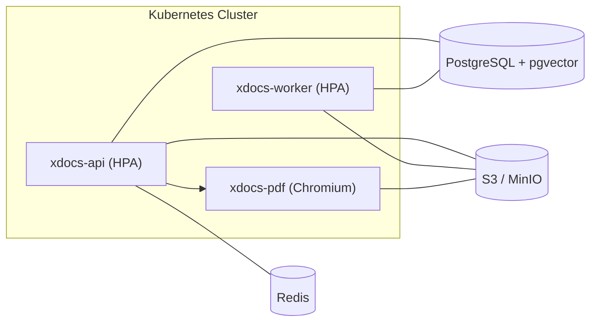

# Xdocs — Embeddable Documentation Control & Service

**Design Document**
Status: Draft for review · Date: 2026-06-25 · Owner: sgbhavsar

---

## 1. Overview

**Xdocs** is an embeddable documentation experience made of two parts:

1. **A front-end HTML control** — a framework-agnostic **Web Component** (`<xdocs-viewer>`) built with vanilla JavaScript + Tailwind CSS. It can be dropped into *any* host web application with a single `<script>` tag. It renders a documentation site with a three-pane layout: left navigation index, center markdown content, and a right-side in-page heading index (table of contents).

2. **A Python micro-service backend** — a **FastAPI** service that stores documents (markdown) in **PostgreSQL**, provides search via **Postgres full-text + pgvector**, integrates an **LLM (OpenAI / Azure OpenAI)** for Q&A / summarization / extraction, and exports pages or whole documents to **PDF** via a server-side headless browser.

The product is comparable in spirit to documentation portals such as **docs.aveva.com**, **Microsoft SQL Server documentation**, Confluence, GitBook, and ReadtheDocs — but packaged as a reusable, themeable control that any application can embed, plus a full CMS for authoring.

### 1.1 Goals

- A **drop-in, style-isolated** documentation control usable by any web app, regardless of its framework.
- A **master/landing page** aggregating multiple documentation sets (spaces/products) with global search.
- Three-pane reading experience with **responsive** behavior (right TOC appears only when space allows).
- **Full CMS authoring**: create/edit markdown, drafts → publish, revision history, and multiple released product versions.
- **Rich markdown**: syntax-highlighted code, Mermaid diagrams, GFM tables, admonitions/callouts, and KaTeX math.
- **LLM features**: ask questions about docs (RAG with citations), generate summaries, and extract information into a downloadable document.
- **Export** a page or a full document/book to PDF with high fidelity.
- **Multilingual** content and UI (i18n), with human-authored and LLM-assisted translation workflows.
- **Host-driven authentication** — the control is auth-agnostic; the host passes a token the backend validates.
- **Open-source friendly**: permissive license, pluggable provider keys, clean public docs.

### 1.2 Non-Goals (initial release)

- Real-time multi-user collaborative editing (Google-Docs-style cursors). Edits are last-write-wins with optimistic locking + revision history.
- Large/enterprise multi-tenant scale-out (designed for **< 10k pages, < 500 concurrent users**, with a documented scale-out path).
- Building a bespoke identity provider — auth is delegated to the host.

### 1.3 Key Decisions (Summary)

| Area | Decision |
|---|---|
| Embedding | Web Component (custom element, Shadow DOM), single `<script>` |
| Front-end | Vanilla JS core + Tailwind CSS; small focused libs allowed (markdown-it, highlight.js, Mermaid, KaTeX, editor) |
| Backend | Python **FastAPI** + SQLAlchemy + Alembic |
| Storage | **PostgreSQL** (markdown in DB) + **pgvector**; object storage (S3/MinIO) for media |
| Search | Postgres full-text (`tsvector`) + pgvector (hybrid keyword + semantic) |
| LLM | OpenAI / Azure OpenAI, behind a thin provider abstraction |
| Content model | **Spaces → Books → Pages** (nested tree) |
| Versioning | Draft/publish + revision history **and** multiple released product versions |
| LLM output | Ephemeral, download-only (md/pdf) — not persisted as managed docs |
| RAG scope | Scoped (page/book/space/corpus) with a scope selector and **citations** |
| Auth | Host app authenticates; passes JWT/token; backend validates |
| PDF | Server-side headless browser (Playwright/Chromium) |
| Theming | Light/dark + CSS custom-property tokens; logo slot |
| Media | Image/file uploads to object storage |
| i18n | Multilingual content + UI; human + LLM-assisted translation |
| Deployment | Docker + Kubernetes |
| Analytics | Page views / popular docs + LLM answer feedback (👍/👎) |
| License | Open-source intended (permissive, e.g. Apache-2.0/MIT) |
| Tenancy | Single-tenant OSS in v1; schema/auth seams kept multi-tenant-ready |
| Auth token | Host IdP issues JWT directly (no token-exchange endpoint in v1) |
| LLM models | GPT-4o-class chat + `text-embedding-3-small`; budget guard + rate limits |

---

## 2. System Architecture

### 2.1 High-Level Diagram



### 2.2 Components

**Front-end**
- **`<xdocs-viewer>`** — the reader control (3-pane). Shadow DOM for style isolation; Tailwind compiled into the component's shadow stylesheet so host CSS never leaks in or out.
- **`<xdocs-master>`** — the master/landing page listing spaces/books and exposing global search.
- **`<xdocs-admin>`** — the CMS authoring app (heavier libraries confined here): markdown editor, media manager, version/translation management.
- **`xdocs-sdk.js`** — a tiny JS API for the host to configure the control (base URL, token provider, theme tokens, locale, initial route) and to listen to events.

**Backend (FastAPI)**
- **Content API** — spaces/books/pages CRUD, tree navigation, rendered HTML + extracted headings.
- **Search API** — hybrid keyword + semantic search across the corpus (scoped by permissions).
- **LLM API** — RAG chat (streamed), summarize, extract; returns ephemeral artifacts.
- **Export API** — page/book/space → PDF (async job + download URL).
- **Media API** — upload/serve images and attachments.
- **Admin/CMS API** — drafts, publish, revisions, product versions, translations.
- **Auth middleware** — validates host-issued JWT (JWKS), maps claims → permissions.

**Async workers**
- Embedding generation/refresh on publish.
- Search index (tsvector) maintenance.
- PDF rendering jobs.
- LLM-assisted translation drafts.

---

## 3. Front-End Design (HTML Control)

### 3.1 Embedding Model

The control ships as a **custom element** with Shadow DOM. A host integrates it like:

```html
<!-- 1. Load the bundle (from CDN or self-hosted) -->
<script type="module" src="https://cdn.example.com/xdocs/xdocs.js"></script>

<!-- 2. Place the control -->
<xdocs-viewer
  base-url="https://docs-api.example.com"
  space="sql-server"
  locale="en"
  theme="auto">
</xdocs-viewer>

<script>
  const viewer = document.querySelector('xdocs-viewer');

  // Provide the auth token (called whenever a request needs a fresh token)
  viewer.tokenProvider = async () => await myApp.getDocsToken();

  // Optional: react to navigation for deep-linking / host routing
  viewer.addEventListener('xdocs:navigate', (e) => {
    history.replaceState(null, '', `#/docs/${e.detail.path}`);
  });
</script>
```

Design principles:
- **Style isolation** via Shadow DOM; Tailwind is compiled to a single adopted stylesheet inside the shadow root. Host page styles cannot break the control, and the control cannot leak styles into the host.
- **Configuration via attributes + JS properties** (`base-url`, `space`, `locale`, `theme`, `tokenProvider`, `themeTokens`).
- **Events** (`xdocs:navigate`, `xdocs:ready`, `xdocs:error`, `xdocs:search`) let the host integrate routing/analytics.
- **No SPA framework** — vanilla JS modules. Small, focused libraries are allowed for rendering/editing (see §3.6).

### 3.2 Three-Pane Reading Layout

```
┌───────────────────────────────────────────────────────────────────────┐
│  Top bar:  [logo]  Space ▾   Version ▾   Lang ▾    🔍 search    🤖 Ask   │
├───────────────┬───────────────────────────────────┬─────────────────────┤
│ LEFT INDEX    │ CENTER: rendered markdown          │ RIGHT: page TOC     │
│ (page tree)   │  - headings, code, mermaid, math   │  (H2/H3 anchors,    │
│ Spaces ▸ Books│  - admonitions, tables, images     │   scroll-spy        │
│   ▸ Pages     │  - prev/next, edit, export buttons │   highlight)        │
│ collapsible   │                                    │ shown only if room  │
└───────────────┴───────────────────────────────────┴─────────────────────┘
```

**Responsive behavior**
- **≥ 1280px**: all three panes visible.
- **1024–1280px**: right TOC collapses to a floating "On this page" button/popover.
- **768–1024px**: left index becomes a slide-over drawer; center full-width; TOC hidden.
- **< 768px (mobile)**: hamburger drawer for nav, full-width content, TOC via a bottom sheet.

**Right TOC ("if space available")** is derived from the page's heading structure (H2/H3, optionally H4). It uses scroll-spy to highlight the active section and supports click-to-scroll with smooth anchored navigation. It is only mounted when the viewport width clears a configurable threshold.

### 3.3 Left Navigation Index

- Reflects the **Spaces → Books → Pages** tree for the selected space/version/locale.
- Collapsible/expandable nodes; remembers expansion state (localStorage, namespaced).
- Active page highlighted; supports keyboard navigation (arrow keys, Enter).
- Lazy-loads deep subtrees for large books.

### 3.4 Master Page

`<xdocs-master>` renders the landing/portal page. **Composition (decision §16.4): data-driven with optional curated blocks** — it works with zero editorial setup but admins can layer in branded content:
- **Curated blocks (optional)**: admin-managed hero/intro/featured-docs blocks per deployment, rendered above the auto content.
- Cards/sections per **space** (e.g., "SQL Server", "Platform", "API Reference") — auto-generated from the space list.
- **Global search** bar (hybrid search) with type-ahead suggestions and result grouping by space/book.
- Recently updated / popular pages (from analytics).
- Entry point to the **Ask** (LLM) panel scoped to the whole corpus.

### 3.5 Content Rendering Pipeline

Markdown is rendered to HTML and sanitized. To keep rendering consistent and secure, **the backend renders markdown → safe HTML** (server-authoritative), and the front-end enhances client-side widgets:

1. Backend: `markdown-it` (Python equivalent: `markdown-it-py`) → HTML, with plugins for GFM tables, admonitions/callouts, anchors, and heading extraction. Output sanitized (allowlist) before storage/serving.
2. Backend returns `{ html, headings[], meta }` so the front-end can build the right TOC without re-parsing.
3. Front-end progressive enhancement inside the shadow root:
   - **Syntax highlighting**: highlight.js (or Shiki for build-time) with copy-to-clipboard.
   - **Mermaid**: render fenced ```mermaid blocks client-side.
   - **KaTeX**: render `$…$` / `$$…$$` math.
   - **Admonitions/callouts**: styled note/warning/tip blocks.
   - Image lazy-loading, external-link decoration, anchor-on-hover for headings.

> Security note: Mermaid/KaTeX render client-side from already-sanitized fenced content; HTML passthrough in markdown is disabled or strictly allowlisted to prevent stored XSS.

### 3.6 Front-End Dependencies (allowed, focused)

| Concern | Library | Where |
|---|---|---|
| Markdown render (server) | `markdown-it-py` + plugins | Backend |
| Syntax highlight | highlight.js | Viewer |
| Diagrams | Mermaid | Viewer |
| Math | KaTeX | Viewer |
| Markdown editor | CodeMirror 6 (or Milkdown/Toast UI) | Admin only |
| Styling | Tailwind CSS (compiled) | Viewer + Admin |

The **reader control stays light**; heavyweight editing libraries live only in `<xdocs-admin>`.

### 3.7 Theming

- `theme` attribute: `light` | `dark` | `auto` (follows `prefers-color-scheme`).
- Host overrides design tokens via CSS custom properties or `themeTokens` property:

```html
<xdocs-viewer
  theme="auto"
  style="
    --xdocs-color-primary: #0b5cad;
    --xdocs-color-bg: #ffffff;
    --xdocs-font-sans: 'Inter', sans-serif;
    --xdocs-radius: 8px;">
</xdocs-viewer>
```

- A **logo slot** (`<span slot="logo">…</span>`) lets the host brand the top bar.
- Tailwind theme is mapped onto these CSS variables so token overrides flow through utility classes.

### 3.8 Accessibility

- WCAG 2.1 AA target: semantic landmarks, focus management for drawers/popovers, ARIA for the tree and TOC, keyboard-operable search and Ask panel, sufficient contrast in both themes, `prefers-reduced-motion` support.

---

## 4. Backend Design (Python Micro-Service)

### 4.1 Stack

- **FastAPI** (async) for REST + SSE streaming.
- **SQLAlchemy 2.0** (async) ORM + **Alembic** migrations.
- **Pydantic v2** schemas.
- **PostgreSQL 16** with **pgvector** and built-in full-text search.
- **Redis** for caching, rate limiting, and the task queue broker.
- **arq** or **Celery/RQ** for async workers.
- **Playwright (Chromium)** for PDF rendering.
- **Object storage**: S3-compatible (MinIO for self-host).

### 4.2 Service Boundaries

Single deployable FastAPI app organized into modules (a "modular monolith" micro-service — appropriate for the target scale), plus a separate worker deployment and a PDF-render sidecar/deployment:

```
xdocs-api/
  app/
    main.py
    core/            # config, security, db, deps, errors
    auth/            # JWT validation, JWKS cache, permission mapping
    content/         # spaces, books, pages, render, headings
    versions/        # product versions + draft/publish + revisions
    media/           # uploads, storage adapter
    search/          # indexing + hybrid query
    llm/             # provider abstraction, RAG, summarize, extract
    export/          # PDF jobs
    i18n/            # locales, translations
    analytics/       # events, feedback
    admin/           # CMS endpoints
  workers/           # embeddings, indexing, pdf, translation
  migrations/        # alembic
```

### 4.3 Authentication & Authorization

- The **host app authenticates** the user and the **host's IdP issues a signed JWT directly** (decision §16.1 — Xdocs builds no token-exchange endpoint in v1). Xdocs trusts and validates this token.
- Backend validates the JWT signature against the configured **JWKS** (cached), checks `iss`/`aud`/`exp`, and maps claims to:
  - **Identity**: `sub`, `email`, `locale`.
  - **Permissions**: roles/scopes such as `reader`, `editor`, `admin`, and optional **space-level ACLs** (`space:sql-server:read`, `space:platform:write`).
- All content/search/LLM/export queries are **filtered by the caller's readable spaces**.
- The front-end never stores long-lived secrets; it calls `tokenProvider()` to fetch a fresh token on demand and sends it as `Authorization: Bearer …`.

### 4.4 Data Model



Notes:
- **Content lives in `PAGE_TRANSLATION`** (per page × locale), so multilingual is first-class. The default-locale translation is the canonical source for fallback.
- **Versioning is two-dimensional**:
  - *Editorial*: `PAGE.status` (draft/published) + `PAGE_REVISION` history per translation (rollback).
  - *Product*: `PRODUCT_VERSION` lets readers switch between released doc sets (e.g., SQL Server 2019 vs 2022). Each version has a **`visibility` flag** (`internal` vs `published`) and the space **pins a default** version (decision §16.5); readers see only `published` versions and land on the default.
- **Search units are `DOC_CHUNK`** rows (section-sized) with both a `tsvector` (keyword) and a `vector` embedding (semantic) — enabling hybrid search and precise RAG citations (each chunk carries an `anchor`).

### 4.5 Rendering & Caching

- On publish, the backend renders markdown → sanitized HTML, extracts headings, and stores `html_cached` + `headings` on the translation (fast reads, no per-request markdown parsing).
- Read endpoints can serve cached HTML with ETag/Last-Modified; Redis caches hot pages and nav trees.

---

## 5. Search Design

Hybrid retrieval over `DOC_CHUNK`:

1. **Keyword**: Postgres FTS (`websearch_to_tsquery`) over `ts`, with `ts_rank_cd`.
2. **Semantic**: pgvector cosine distance over `embedding` (text-embedding model from OpenAI/Azure).
3. **Fusion**: combine with Reciprocal Rank Fusion (RRF) or weighted scores; group results by page; return best-matching section anchor + snippet highlight.
4. **Filters**: space, book, product version, locale, and the caller's ACL.
5. **Type-ahead**: lightweight title/heading prefix search for instant suggestions.



Indexing: a GIN index on `ts`, an HNSW/IVFFlat index on `embedding`. Embeddings are (re)generated by a worker on publish; stale chunks are pruned.

---

## 6. LLM Integration (Ask · Summarize · Extract)

### 6.1 Provider Abstraction

A thin `LLMProvider` interface wraps **OpenAI / Azure OpenAI** (chat + embeddings), so keys/endpoints are configurable and other providers can be added later. Configuration via env (`LLM_PROVIDER`, `OPENAI_API_KEY` / Azure endpoint + deployment names).

**Default model tier (decision §16.2):** a **GPT-4o-class chat model** for Ask/summarize/extract and **`text-embedding-3-small`** for embeddings — a balanced quality/cost choice. Model names are env-configurable so a deployment can move to a quality-first (`embedding-3-large` + larger chat) or cost-first (mini) tier. A **monthly budget guard** plus per-user/token **rate limits** (Redis) bound spend (see §6.4).

### 6.2 Ask (RAG with Citations)

- **Scope selector** in the UI: *This page* · *This book* · *This space* · *Entire corpus* (default: current **space**, ACL-limited).
- Pipeline: embed question → hybrid retrieve top-k chunks within scope → build grounded prompt with chunk texts + anchors → stream answer via **SSE** → render answer with **inline citations** linking back to the exact page/section.
- Guardrails: system prompt instructs the model to answer **only from provided context** and to say when the docs don't cover it; show the cited sources list under each answer.



### 6.3 Summarize & Extract

- **Summarize**: summarize the current page / selected pages / a whole book into a concise document (configurable length/style).
- **Extract**: user describes what to pull (e.g., "all configuration parameters and defaults as a table"); the model extracts structured info from the in-scope content.
- **Output is ephemeral, download-only**: results render in a side panel with **Copy**, **Download .md**, and **Download .pdf** (reusing the export pipeline). They are **not** persisted as managed CMS documents. (A future option could let users save them as pages.)

### 6.4 Cost, Caching, Limits

- Cache query embeddings; reuse retrieval for follow-ups; cap context tokens.
- Per-token/user rate limits (Redis) and a configurable monthly budget guard.
- **Feedback (👍/👎)** captured per answer for quality tracking (see Analytics).

---

## 7. PDF Export

- **Server-side, high-fidelity** rendering via headless **Chromium (Playwright)**.
- Two scopes: **single page** and **full book/space** (concatenated, with cover page, TOC, and page numbers).
- Flow: client requests export → API enqueues a job → worker assembles a print-optimized HTML (same renderer + a print stylesheet, Mermaid/KaTeX rendered) → Chromium prints to PDF → stored in object storage → API returns a short-lived signed download URL → client downloads.
- Print CSS: page breaks before H1/H2, repeated headers/footers, link URLs footnoted, image scaling, code-block wrapping.
- The same pipeline backs the **LLM artifact → PDF** download.



---

## 8. CMS / Authoring (`<xdocs-admin>`)

Full editing capability, gated by `editor`/`admin` permissions:

- **Markdown editor** (CodeMirror 6) with live preview using the *same* render pipeline as the reader (WYSIWYG-accurate).
- **Tree management**: create/move/reorder spaces, books, pages (drag-and-drop, `sort_order`).
- **Drafts → Publish**: edits saved as drafts; explicit publish triggers HTML render, embedding refresh, and search re-index.
- **Revision history**: view diffs, restore previous revisions per translation.
- **Product versions**: clone/branch a version (e.g., create "2022" from "2019"), set the default/visible versions.
- **Media manager**: upload images/attachments → object storage; insert into markdown; usage tracking.
- **Translations**: per-locale editing; **LLM-assisted draft** generation + **human review/approval** workflow (`translation_status`: `llm_draft` → `approved`); UI strings managed via locale resource files.
- **Optimistic locking** (revision/version check) to avoid clobbering concurrent edits; conflict prompts.

---

## 9. Internationalization (i18n)

- **Content**: per-page-per-locale translations (`PAGE_TRANSLATION`). Reader shows a **language switcher**. **Missing-translation behavior (decision §16.3):** show the space's default-locale content with a "not translated" notice **and a one-click inline LLM auto-translation** action. Auto-translations are **ephemeral** (cached per page-revision × locale, not stored as managed content); authoritative translations are produced via the CMS review workflow below.
- **UI strings**: the control loads locale bundles (JSON) for its own chrome (buttons, labels), selected via the `locale` attribute or host preference.
- **Search & RAG** are locale-aware (query within the active locale, with fallback).
- **Translation production**: both **human-authored** and **LLM-assisted** (draft → review → approve), per §8.

---

## 10. Analytics

Privacy-conscious, minimal:
- **Page views / popular docs**: aggregate counts per page/section to power "popular" and "recently updated" on the master page.
- **LLM answer feedback**: 👍/👎 (+ optional comment) stored per answer with the question hash and scope, for quality tuning.
- **Search analytics (queries / zero-result terms) are deferred** to a later phase (decision §16.7); the `ANALYTICS_EVENT.type` schema already supports a `search` type so it can be enabled without migration.
- Stored in Postgres; surfaced via simple admin dashboards. No third-party trackers; respects host privacy posture.

---

## 11. API Surface (REST, illustrative)

| Method | Path | Purpose |
|---|---|---|
| GET | `/spaces` | List spaces (ACL-filtered) |
| GET | `/spaces/{slug}/tree?version=&locale=` | Nav tree (books/pages) |
| GET | `/pages/{id}?locale=&version=` | Rendered HTML + headings + meta |
| GET | `/search?q=&scope=&locale=&version=` | Hybrid search |
| POST | `/llm/ask` (SSE) | RAG Q&A with citations |
| POST | `/llm/summarize` | Summarize scope → artifact |
| POST | `/llm/extract` | Extract info → artifact |
| POST | `/llm/feedback` | 👍/👎 on an answer |
| POST | `/export` / GET `/export/{job}` | PDF job + status/URL |
| POST | `/media` / GET `/media/{key}` | Upload / serve assets |
| — | **Admin** | — |
| POST/PUT/DELETE | `/admin/spaces|books|pages` | CRUD + reorder |
| POST | `/admin/pages/{id}/publish` | Publish draft |
| GET/POST | `/admin/pages/{id}/revisions` | History / restore |
| POST | `/admin/versions` | Manage product versions |
| GET/PUT | `/admin/pages/{id}/translations/{locale}` | Translation editing |
| POST | `/admin/translations/{locale}/draft` | LLM-assisted draft |

All responses are JSON (Pydantic), documented via FastAPI's auto-generated OpenAPI/Swagger UI.

---

## 12. Security

- **Token validation** (JWKS), `aud`/`iss`/`exp` checks, short token lifetimes.
- **ACL enforcement** on every read/search/LLM/export path (defense in depth).
- **Markdown sanitization** (server-side allowlist) to prevent stored XSS; HTML passthrough disabled by default.
- **Shadow DOM** isolation reduces host/control style and DOM interference.
- **CORS** allowlist for host origins; **CSP** guidance for hosts.
- **Rate limiting** (Redis) on search, LLM, export, upload.
- **Upload validation**: content-type/size limits, image re-encoding, signed URLs for serving.
- **Secrets** (LLM keys) only server-side; never shipped to the browser.
- **PII / LLM**: document data-flow to the LLM provider; allow Azure OpenAI for data-residency; configurable opt-out of provider training (provider-dependent).

---

## 13. Deployment & Operations

- **Containers**: `xdocs-api`, `xdocs-worker`, `xdocs-pdf` (Chromium), plus `postgres` (with pgvector), `redis`, and `minio` (or cloud S3) for self-host.
- **Kubernetes**: Deployments + HPA for API and workers; PVCs/managed services for Postgres; Helm chart for install.
- **Local dev**: `docker-compose` bringing up the full stack.
- **Tenancy (decision §16.6)**: v1 is **single-tenant per deployment** (one org). ACL/query layers are centralized and the data model leaves seams (scoped repositories, an implicit tenant boundary) so multi-tenant isolation can be introduced later without a breaking migration.
- **CI/CD**: lint/test, build images, run Alembic migrations on deploy.
- **Observability**: structured logging, Prometheus metrics, health/readiness probes, request tracing.
- **Config**: 12-factor env vars; example `.env` and Helm `values.yaml`.



---

## 14. Repository Layout (proposed)

```
xdocs/
  frontend/
    viewer/            # <xdocs-viewer>, <xdocs-master> (vanilla + Tailwind)
    admin/             # <xdocs-admin> CMS app
    sdk/               # host-facing JS SDK
    build/             # bundling (esbuild/vite-lib), Tailwind config
  backend/
    app/               # FastAPI modules (see §4.2)
    workers/
    migrations/        # Alembic
    tests/
  deploy/
    docker/            # Dockerfiles
    compose/           # docker-compose.yml
    helm/              # k8s chart
  docs/
    design/            # this document
  LICENSE              # permissive (Apache-2.0 / MIT)
  README.md
```

---

## 15. Phased Delivery Plan

**Phase 0 — Foundations**
- Repo scaffolding, FastAPI skeleton, Postgres + pgvector + Alembic, Docker Compose, auth (JWT validation) stub, Web Component build pipeline + Tailwind-in-shadow.

**Phase 1 — Read Experience (MVP)**
- Content model (spaces/books/pages, default locale), server-side markdown render + heading extraction, `<xdocs-viewer>` three-pane layout (left nav, content, right TOC, responsive), `<xdocs-master>`, theming tokens, code highlight + Mermaid + KaTeX + admonitions.

**Phase 2 — Search**
- Chunking, embeddings worker, hybrid FTS + pgvector search, type-ahead, scoped/ACL filtering, search UI.

**Phase 3 — LLM Features**
- Provider abstraction, RAG Ask with citations + scope selector (SSE), summarize/extract → ephemeral artifacts, feedback capture.

**Phase 4 — Export**
- Server-side PDF (single page + full book), print CSS, async jobs, artifact-to-PDF.

**Phase 5 — CMS Authoring**
- `<xdocs-admin>`, editor + live preview, drafts/publish, revision history, media manager, optimistic locking.

**Phase 6 — Versions & i18n**
- Product versions (switcher + branching), multilingual content + UI, LLM-assisted translation drafts + review workflow.

**Phase 7 — Hardening & Open Source**
- Analytics dashboards, accessibility audit, security review, Helm chart, docs, license, examples, performance passes.

---

## 16. Resolved Decisions

The initial open questions have been decided as follows (these are now binding for planning):

1. **Token issuance** — **Host IdP issues the JWT directly.** Xdocs does not build a token-exchange endpoint in v1; it only validates host-issued JWTs via JWKS (see §4.3). Integration docs will specify the required claims (`sub`, `email`, `locale`, roles/scopes, space ACLs), `aud`, `iss`, and signing algorithm (RS256/ES256).
2. **Models & budget** — **Balanced tier:** a GPT-4o-class chat model for RAG/summarize/extract + `text-embedding-3-small` for embeddings, behind the provider abstraction. A configurable **monthly budget guard** and per-user/token **rate limits** (Redis) protect cost. Model names are env-configurable so deployments can move to a quality-first or cost-first tier.
3. **Missing-translation fallback** — **Show source-language content with inline one-click LLM auto-translation.** When a page lacks the reader's locale, render the default-locale content with a "not translated" notice and an **on-the-fly LLM translation** action. Auto-translations are **ephemeral (not persisted)**; authors can still produce reviewed, stored translations via the CMS workflow (§8). On-demand translation respects the LLM budget/rate limits and is cacheable per (page revision × locale).
4. **Master page composition** — **Data-driven with optional curated blocks.** The landing page auto-lists spaces/books plus popular & recently-updated sections, and admins may add curated hero/intro/featured blocks per deployment (managed content). Default deployments work with zero editorial setup.
5. **Version UX** — **Per-version visibility flags + a pinned default.** Each `PRODUCT_VERSION` carries a visibility state (`internal/draft` vs `published`) and the space pins a default version (typically "latest"). Readers can switch only among **visible** versions; this lets teams stage an unreleased version before publishing.
6. **Packaging / tenancy** — **Single-tenant OSS now, multi-tenant-ready schema.** v1 ships a clean single-tenant self-host (one org per deployment) under a permissive license, but auth/ACL and data-model seams are kept so multi-tenant isolation can be added later **without a breaking migration** (e.g., nullable/implicit `tenant_id` boundaries, scoped queries already centralized).
7. **Search analytics** — **Deferred** to a later phase. v1 captures page views / popular docs + LLM answer feedback only. The `ANALYTICS_EVENT` schema already supports a `search` event type, so query / zero-result capture can be enabled later without migration.

---

*End of design document.*
